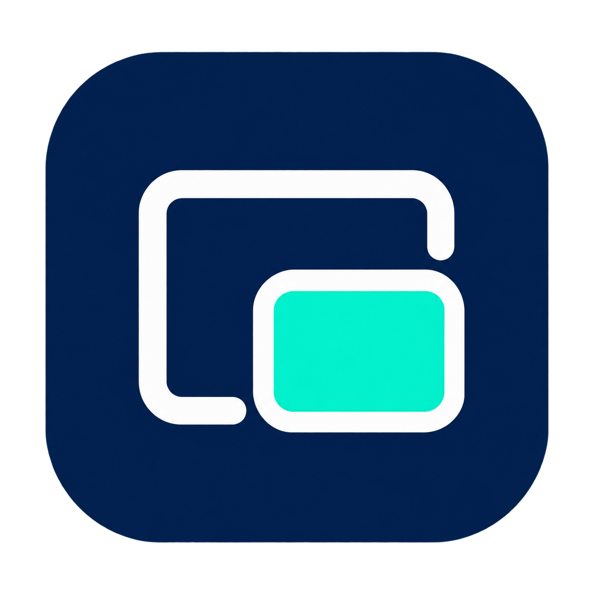

<p align="center"></p>
<h1 align="center">Cua Child MCP</h1>
<p align="center">通用 Windows 子桌面 · 自动启动 · stdio MCP 透明代理</p>

让 MCP 客户端通过独立的 Windows Child Session 操作桌面应用，同时保留主桌面供用户使用。首次连接创建或重连子会话并启动 Cua Driver Worker，后续连接直接复用；工具接口和协议由上游 Cua Driver 提供。

## 使用

双击 `cua-child.exe`（或不带参数运行）打开控制中心，**不会自动创建、连接子会话或启动 Worker**。MCP 客户端必须显式传入 `mcp` 参数，仍会按请求自动启动/复用子会话和 Worker。

从 [Releases](https://github.com/LexaTang/cua-child-mcp/releases) 下载 Windows x64 ZIP，解压到固定目录。每个发布包附带 SHA-256 校验文件；MCP 配置中的程序路径应替换为实际解压路径。

在解压目录运行 `./cua-child.exe config`，即可输出当前电脑实际路径对应的 MCP JSON 配置；复制到客户端的 MCP 设置中。移动程序目录后请重新生成。发布包不预生成包含构建机路径的配置。

如果使用 v0.1.0 包里的 `mcp.json` 遇到 `D:\a\...` 路径错误，请将 `command` 改为本机实际的 `cua-child.exe` 完整路径，并删除指向旧路径的 `--driver` 参数（如有）；默认 Driver 位于程序旁的 `driver` 文件夹。只在异常堆栈源码行号中出现的构建路径不代表程序正在访问该路径。

在 Windows 上运行便携包的 `cua-child.exe mcp`，或将它添加为 MCP 服务：

```json
{
  "mcpServers": {
    "cua-child": {
      "command": "C:\\Tools\\cua-child-mcp\\cua-child.exe",
      "args": ["mcp"]
    }
  }
}
```

首次启动可能需要管理员启用 Windows Child Sessions：在管理员终端执行一次 `cua-child.exe enable`，保存工作并注销 Windows 后重新登录（或重启电脑），然后以普通用户运行 MCP 客户端。便携包自带 .NET 运行时和固定版本 Driver，无需安装 Node、Python 或 Rust。

Codex 可使用以下配置（启动超时给首次创建子桌面留出时间）：

```toml
[mcp_servers.cua-child]
command = 'C:\Tools\cua-child-mcp\cua-child.exe'
args = ["mcp"]
startup_timeout_sec = 120
tool_timeout_sec = 120
```

## 直接控制子桌面

```powershell
./cua-child.exe view
```

显示实时 RDP 控制窗口。点击画面后鼠标键盘进入子桌面；支持窗口缩放、重连、状态显示和托盘隐藏。Ctrl+Alt+Home 释放键盘捕获。关闭窗口仅隐藏，应用与 MCP 继续运行；再次执行 `view` 或双击托盘图标恢复窗口。托盘菜单可退出控制器并断开显示，不注销子桌面。

控制中心采用桌面优先布局：顶部紧凑菜单；所有操作收纳到菜单中，底部状态栏，远程桌面占据主体。设置使用独立滚动窗口，操作按钮固定在底部。

控制中心提供：

- 子会话启动/连接、断开画面、注销及重建。注销/重建会先提示关闭子桌面内的程序；主桌面不会被注销。
- MCP Worker 状态、启动、停止及重启，以及 MCP 配置管理。手动启动 Worker 前先连接子桌面并完成登录。停止 Worker 会中断现有 MCP 调用；客户端重新连接可以再次启动它。
- 分辨率预设和自定义尺寸（640–7680 × 480–4320）、16/32 位颜色、画面缩放、剪贴板和磁盘重定向、音频位置、Windows 组合键发送位置、窗口全屏。
- 保存设置，或保存后重新连接显示；重新连接不注销会话。设置存于 `%LOCALAPPDATA%\CuaChild\view-settings.json`，应用启动不会自动建立连接。部分分辨率和重定向选项的生效仍取决于 Windows RDP 支持。

“窗口全屏”放大控制器窗口；选择“组合键：仅窗口全屏”时，会随窗口模式切换发送位置。停止/重建功能需要新版会话宿主；遇到旧版宿主时会拒绝强制结束它，需先退出旧版宿主。

`cua-child.exe status` 查看状态。`--driver <path>` 可选择其他 Driver 分发目录，`--timeout 90` 控制启动等待。

### MCP 配置管理

点击 **菜单 → MCP → 配置管理**，可创建配置文件、添加 stdio 服务或修改已有服务。支持 Codex TOML（默认使用 CODEX_HOME 下的 config.toml，未设置时使用 ~/.codex/config.toml）和通用 mcpServers JSON。

选择文件并读取后，选择已有服务名称修改，或输入新名称新增服务；可一键填入本程序路径，编辑命令、参数与 Codex 超时。点击预览检查合并后的完整配置，再保存。已有文件会生成同目录备份；若文件在读取后被其他程序改动，会拒绝覆盖并要求重新读取。

编辑会保留其他服务及环境变量等额外字段，但可能重新排版。HTTP 服务不能通过此编辑器修改，JSON 文件需使用标准 JSON。保存后在对应客户端重新加载 MCP 服务。

## 构建

需要 Windows 和 .NET 9 SDK：

```powershell
dotnet build -c Release
./package.ps1 -OutputDirectory ./dist
./dist/cua-child.exe self-test
./integration-test.ps1
```

打包脚本下载 `cua-driver-rs-v0.26.1` 的 Windows x64 发布包，对照官方 SHA-256 清单校验，生成 self-contained 可执行程序。MCP 配置通过解压后的 `config` 命令生成。Windows CI 也提供构建产物。

图标源图为 `assets/icon.png`，封面直接使用同一图形；`assets/app.ico` 包含 16、20、24、32、40、48、64、128、256 像素版本。执行 `scripts/build-icon.ps1` 可从源图重新生成 ICO。ICO 嵌入 EXE，并用于控制窗口、任务栏与托盘。

## localhost 提示凭据不工作

首次启用后，先保存工作并**注销 Windows 后重新登录，或重启电脑**，再运行程序。只关闭程序、重启 MCP 客户端或锁屏解锁，不能替代重新登录。

[微软的 Child Sessions 文档](https://learn.microsoft.com/en-us/windows/win32/termserv/child-sessions)说明：主会话在启用子会话之前就已登录，或使用智能卡登录时，子会话可能要求凭据，不能保证自动登录。因此在新电脑上刚启用就连接，可能遇到该提示。

如果重新登录后仍然出现，请提供 Windows 版本/版本号、账号类型（本地、Microsoft、域或 Entra ID）、登录方式（密码、PIN、指纹或智能卡）、`cua-child.exe status` 的输出及 `host-error.txt`（如果存在）。不要提供密码。这些信息用于区分父会话凭据、系统策略和 RDP 连接问题；本程序不自动修改凭据委派策略或关闭 NLA。

控制窗口的“菜单 → 打开日志目录”菜单可打开日志目录。`rdp-进程号.log` 默认记录可执行文件路径、进程号、配置地址/端口及连接状态变化，不记录密码。配置的 RDP-Tcp 端口不能证明子会话实际使用了该端点。连接卡住时，在管理员 PowerShell 中执行包内 `./collect-rdp-connection.ps1`，采集客户端实际 TCP 端点、对应监听器和进程信息。

COM 登录事件跟踪尚未完成实际连接兼容性验证，默认关闭；仅在专门对照测试时使用环境变量 `CUA_CHILD_RDP_EVENTS=1` 启用。RDP 已连接不等于 Windows 登录已完成。日志单文件超过 1 MiB 时保留一份上一段记录；各次运行的日志可在诊断后手动清理。切换程序版本前从托盘退出旧控制器，否则 `view` 会唤起仍在运行的旧实例。

## 自动构建与发布

GitHub Actions 在推送 `main`、提交 PR 或手动运行时编译 Windows x64 便携包，执行 CLI 自检，并上传 ZIP 和 SHA-256 文件作为构建产物。

推送版本标签后，构建成功会自动创建 GitHub Release、生成发布说明并附加 ZIP 和校验文件。例如：

```powershell
git tag v0.1.0
git push origin v0.1.0
```

标签格式为 `v主版本.次版本.修订版本`；`v0.1.0-rc.1` 等带后缀标签自动标记为预发布。附件先上传到草稿，齐全后公开；重跑会恢复未完成的草稿，已公开的版本保持不变。新修改请使用新版本标签。工作流使用 GitHub 自带的 `GITHUB_TOKEN`，无需配置额外密钥。

CI 不运行需要交互桌面的 `integration-test.ps1`；完整 Child Session 功能仍需在 Windows 桌面实机验证。

## 工作方式与限制

- 当前用户和父会话专属的命名管道；校验服务端 Session ID，避免误连主桌面。
- Mutex 串行化首次启动；独立宿主维持 RDP，MCP stdin EOF 不注销子桌面。
- 使用 Windows RDP ActiveX 的 `ConnectToChildSession`；通过 Task Scheduler `RunEx` 将 Worker 定向启动到子会话。就绪后删除临时任务。
- 标准流按字节转发到上游 `cua-driver mcp --socket`，启动诊断写入 stderr。
- Windows 同时只支持一个已连接的 Child Session。它与主会话共享用户配置；父会话注销也会结束子会话。
- 控制窗口会连接同一个 Child Session，可能取代此前的隐藏 RDP 连接。
- 上游 Cua 的权限限制、逻辑会话空闲回收和工具兼容性仍适用。Windows Child Session 与 MCP 逻辑 session 是不同的生命周期。
- 日志目录：`%LOCALAPPDATA%\CuaChild\<SID>-<parent-session>`。

已在 Windows 实机验证启动/恢复、57 个工具发现、只读工具调用、并发复用和控制窗口连接。全部桌面操作、所有 Windows 版本以及长时间 RDP 断连重连尚未全面验证。

## 来源与许可

本项目是独立的生命周期封装，基于 [Cua Driver](https://github.com/trycua/cua) 的公开 CLI 和 Windows API；不复制整个上游仓库。上游来源基线为 `b4e3caecd709311d613dde29ddac03e29468bb38`，分发依赖版本为 0.26.1。

本项目采用 [MIT License](LICENSE)。Cua Driver 的许可证保留在 [CUA-LICENSE.md](CUA-LICENSE.md)。原创图标的生成方式和提示词见 [assets/PROVENANCE.md](assets/PROVENANCE.md)。本项目不代表 Microsoft、OpenAI 或 Cua 官方。

TOML 解析使用 Tomlyn 0.19.0，其 BSD-2-Clause 许可证保留在 [TOMLYN-LICENSE.txt](TOMLYN-LICENSE.txt)。
